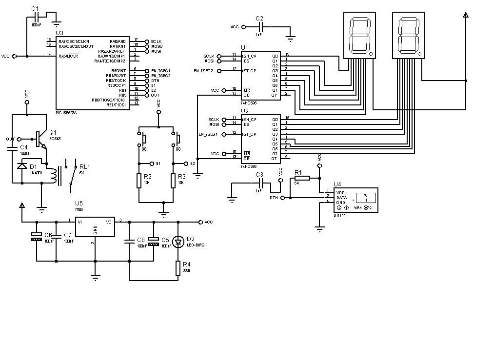

# TermostatoPic
O controle preciso da temperatura desempenha um papel fundamental em diversos contextos, desde o conforto doméstico até processos industriais. Nesse contexto, o projeto proposto visa desenvolver um termostato inteligente, capaz de monitorar e regular a temperatura de forma eficiente. Utilizando tecnologias inovadoras, pretendemos criar um dispositivo que não apenas otimize o consumo energético, mas também proporcione uma experiência intuitiva ao usuário. A integração de sensores avançados e algoritmos de controle inteligentes será explorada para garantir uma resposta rápida e eficaz às variações térmicas. Este projeto visa contribuir para a eficiência energética e o conforto ambiental, alinhando-se às demandas crescentes por soluções sustentáveis e tecnologicamente avançadas.
# 
O projeto será dividido em 6 partes, compilar os arquivos BCDDisp e frimware no mikroC PRO for PIC, para o pic 16f628a.

Lista de material:

1 Pic 16f628A.

1 Sensor DHT11.

2 74HC595.

2 Display 7 Segmentos com o Catodo comum.

2 Resistores de 10k.

2 Push button.

6 Capacitores ceramicos 100nF.

1 Diodo 1N4007.

1 Trasistor BC548.

1 Rele bobina 5V.

2 Capacitores de 100uf 12v.

1 Regulador LM7805 TO-220

1 Resistor de 330R.

1 LED vermelho 5mm.

#
1 O esquemático, código preliminar com recurso de teste dos displays.

2 Acréscimo do sensor de temperatura, atuaização do firmware principal, acréscimo do biblioteca do DHT11.

3 Acréscimo de 2 push button para setar a temperatura de disparo, atuaização do firmware principal leitura dos botões.

4 Acréscimo do circuito de potencia do acionador da saida para resistência atuaização do firmware principal rotina de acionamento do rele de saida.

5 Acréscimo do circuito de alimentação.

#

